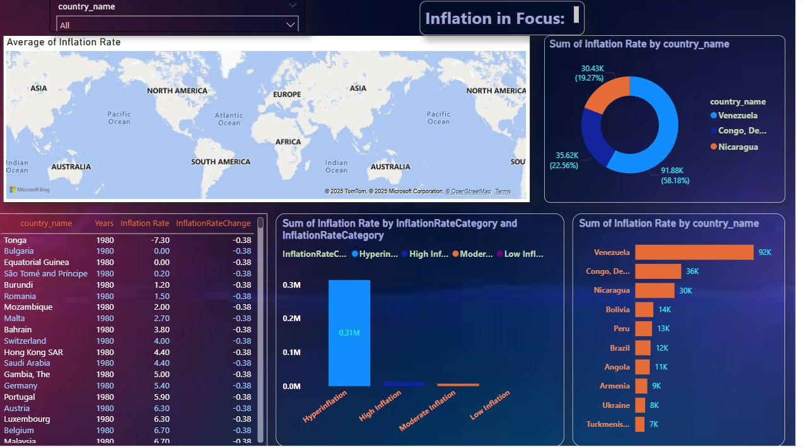

# 📊 Power BI Inflation Analysis: Journeying Through Global Economic Terrain


---

## 📌 Project Overview

This project explores **global inflation trends from 1980 to 2024** using **Power BI**.
The goal is to transform raw inflation data into **interactive dashboards** that uncover hidden patterns, historical outliers, and regional differences in inflation rates across the world.

It provides insights into:

* Global inflation cycles across four decades
* Country-level comparisons (stable vs volatile economies)
* Regional inflation trends and their economic implications
* The impact of major events (2008 crisis, COVID-19 pandemic, etc.) on inflation

---

## 🎯 Objectives

* 📥 **Data Acquisition & Preprocessing** – Clean, transform, and prepare raw inflation data
* 🔎 **Exploratory Data Analysis (EDA)** – Identify key trends, seasonal patterns, and anomalies
* 📊 **Interactive Dashboard Development** – Build dynamic visualizations with slicers & filters
* 📑 **Comprehensive Reporting** – Document methodology, findings, and future scope

---

## 🛠️ Tools & Technologies

* **Power BI** (Dashboards, Power Query, Visualization)
* **DAX** (Custom measures, time intelligence, calculations)
* **Data Modeling** (Star Schema with Dates table)

---

## 📂 Project Structure

```bash
📁 Power-BI-Inflation-Analysis-Journeying-Through-Global-Economic-Terrain
│── 📊 Dashboard_Screenshot.jpg   # Power BI Dashboard snapshot
│── 📜 Project Report.pdf         # Detailed documentation of methodology & insights
│── 🎓 Internship Certificate.pdf # Internship completion certificate
│── Inflation_Analysis.pbix       # Power BI dashboard file
│── README.md                     # Project overview (this file)
```

---

## 📸 Dashboard Preview



---

## 💡 Key Insights

* Developed nations (e.g., Japan, Switzerland) show **long-term stability**
* Emerging economies (e.g., Venezuela, Argentina) faced **volatile inflation & hyperinflation**
* Global events such as the **2008 financial crisis** and **COVID-19 pandemic** strongly impacted inflation trends
* **9+ visualizations** and **5 DAX measures** power the dashboard for deep analysis

---

## 🚀 How to Use This Dashboard

1. **Download the `.pbix` file**

   * Clone this repository or directly download the `Inflation_Analysis.pbix` file.

2. **Open in Power BI Desktop**

   * Install [Power BI Desktop](https://powerbi.microsoft.com/desktop/).
   * Open the `Inflation_Analysis.pbix` file.

3. **Explore the Dashboard**

   * Use **filters/slicers** to switch between years, countries, and regions.
   * Interact with visuals (maps, bar charts, line charts, histograms).
   * Compare **global averages vs country-level inflation**.

4. **Modify / Extend (Optional)**

   * Add more datasets (e.g., GDP, interest rates).
   * Create new DAX measures for deeper analysis.
   * Publish your customized version to Power BI Service.

---

## 🚀 Future Scope

* Integrate other economic indicators (GDP, unemployment, interest rates)
* Add **predictive modeling** to forecast future inflation
* Expand dataset to include **monthly/quarterly data** for granular insights
* Deploy dashboard online for public access

---

## 📜 Certificate


---

## 🔗 Links

* 📂 **GitHub Repository:** [Power BI Inflation Analysis](https://github.com/Shivashankar-2023/Power-BI-Inflation-Analysis-Journeying-Through-Global-Economic-Terrain)
* 📑 **Full Project Report:** [Project Report.pdf](./Project%20Report.pdf)
---
🤝 Contributing
Contributions are welcome!

Fork the repo
Create a new branch
Submit a pull request 🎉

---

🌟 If you like these projects, don’t forget to star ⭐ this repo!

---

👨‍💻 **Author:** *Kancharla Shiva Shankar*
---
